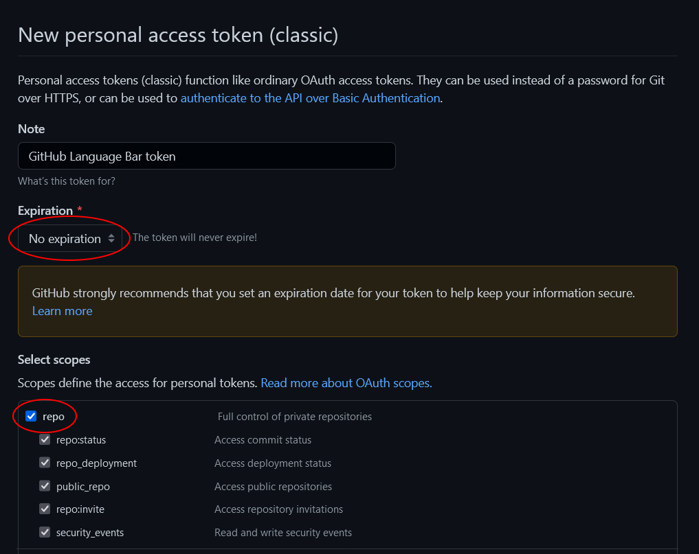

<h1 align="center">GitHub Language Bar</h1>

<!--  -->

## Features

TODO

<!-- - Hosted on github actions. No 3rd party servers (like Heroku) required. Is GitHub working?<sup>\[?\]</sup> Yes? Than ...
- Includes private repositories (because you can specify GITHUB_TOKEN)*

But is does not spam you with commits! Only one commit on a separate branch you will never have to worry about

It's worth mentioning [github-readme-stats](https://github.com/anuraghazra/github-readme-stats#language-card-exclusive-options), in whitch I didn't find all of the listed fetures -->

## Wanna add one to you profile?

> It's just three easy steps!  TODO That will take you 5 min

1. Generate a new **repo**-scoped personal access token and add it to your repository[^1]:
    - Go to https://github.com/settings/tokens/new
    - Name the token as you like, e.g. `Language-Bar-token`
    - Set `Expiration` date to `No Expiration`
    - Click on the first checkbox named `repo`
    - `Generate token` down below
    - Finally, copy your new token to your clipboard

    <details>
    <summary>Help me find these buttons!</summary>

    
    </details>

    Add this token to your repository:
    - Go to your repository settings, then (on the left side) `Secrets and Variables` -> `Actions`
    - Click on `New repository secret`
    - Name it `LANG_BAR_PAT`
    - Paste the copied token into the `secret` textarea
    - Hit `Add secret`

    <details>
    <summary>Help me find these buttons!</summary>

    
    </details>


2. Create a workflow file named `language_bar.yml` in your repository under `.github/workflows` folder and paste the following content inside:
    ```YAML
    name: GitHub Language Bar

    on:
      push:
        paths:
          - '/README.md'
          - '/.github/workflows/language_bar.yml'
      workflow_dispatch:

    jobs:
      language_bar:
        name: Create GitHub Language Bar
        runs-on: ubuntu-latest
        steps:
          - name: Create Language Bar
            uses: npanuhin/GitHub-Language-Bar@master
            with:
              gh_token: ${{ secrets.LANG_BAR_PAT }}
    ```

3. Add this mark anywhere in your README:
    ```html
    <!-- Langbar -->
    ```

4. . . . There is no 4th step, you are all set! Your bar should appear in a few seconds. You can also [customize](#Customize) your new language bar in various ways. If you have any questions, [don't hesitate to ask](https://github.com/npanuhin/GitHub-Language-Bar/issues/new)!

## Customize

TODO

<!-- query with multiple keys params -->
<!-- replacements -->


## Development

#### Code linting
```bash
pip install -U -r ".github/flake8.requirements.txt"
flake8 --show-source --statistics

# To install pre-commit hook:
pip install -U pre-commit
pre-commit install --config ".github/.pre-commit-config.yaml"
```

#### Access token
Generate and place your PAT in `/.gh_token` file

#### TODO List
- Convert `Jupyter Notebook` to `Python` with some coefficient (like 0.1), or maybe even parse it
- Hide unwanted languages option
- **Different styles for dark and light mode**
- Fetch only needed repositories
- Maybe exclude certain languages from the repositories individually (`exclude=repo.language`)?


[^1]: This is needed for the script to be able to include you private repository stats
